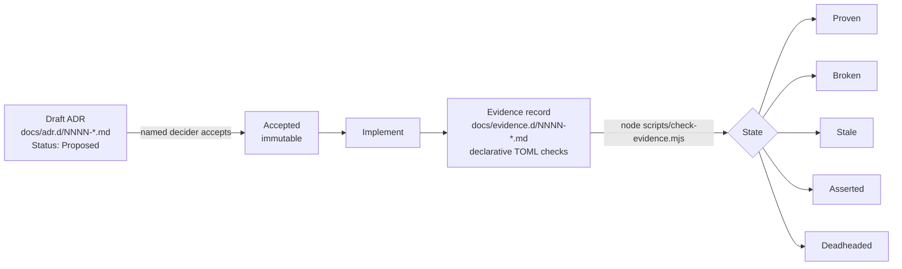
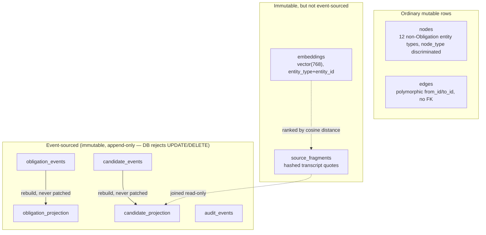

# Ringmaster — Architecture Summary

> Point-in-time snapshot for review, regenerated 2026-08-14. This is a summary
> for orientation, not a governing document — [`docs/adr.d/`](adr.d/README.md)
> is the source of truth for what's actually decided, and `docs/evidence.d/`
> (via `node scripts/check-evidence.mjs`) for what's actually proven.
> Re-generate rather than hand-edit if it drifts.

**Tagline:** *Keep the whole show moving.* A management operating system — an
attention-allocation tool for engineering managers, not a task tracker.
Primary entity is the **Obligation** (promises, requests, risks, decisions,
follow-ups), not work items. North-star question: *what deserves my attention
now, and what will become a problem if I ignore it?*

Repo: [github.com/monk-eee/ringmaster](https://github.com/monk-eee/ringmaster)
(public). Owner/sole decider: **monk-eee**. Status: personal working draft,
single-user v1, actively built by multiple concurrent agent sessions under a
strict ADR-governance process.

---

## 1. Governance model (the repo's defining characteristic)

Every mutation to source, tests, config, infrastructure, or pipelines
requires an **accepted Architecture Decision Record (ADR)** first
([ADR-0001](adr.d/0001-require-governing-adr-coverage-before-implementation.md)).
This is enforced by convention + a CI gate, not by tooling that blocks
commits.

- **ADR** = intent/decision (immutable once accepted; changes go in a *new*
  ADR that amends/supersedes).
- **Evidence** (exact-name companion under `docs/evidence.d/`) = current,
  rerunnable proof, kept deliberately separate
  ([ADR-0002](adr.d/0002-keep-current-evidence-separate-from-accepted-decisions.md))
  so intent and reality can't be confused.
- `node scripts/check-evidence.mjs` derives state from declarative checks
  (`present`/`absent` regex over files, `parity` = every accepted ADR has
  evidence, `manual` = human-asserted, decays to `Stale` after a threshold).
  Never executes shell code from evidence data.
- All 26 ADRs are **Accepted**. Evidence currently reports 25 `Proven` and
  one intentionally-`Asserted` (`ADR-0004`, a policy-only, non-code
  decision) — zero `Broken`. Re-run the checker for the current count.

---

## 2. Product vision

- **Chain:** `Customer Problem → Business Goal → Commitment → Feature → ADO Work → Delivery`.
  The commitment is the durable object; everything else changes around it.
- **Time-centric, not work-centric:**
  `Date/Horizon → Obligation → Risk → Action → Evidence → Outcome`, with a
  7/30/60/90-day future-risk horizon as the eventual goal view (still not
  built — see gaps).
- **"The UX is the product"** — a later, substantial vision addendum
  ([VISION.md § The Daily Brief](VISION.md#the-daily-brief)) reframed the
  home screen itself, not the graph/infrastructure underneath it, as the
  actual product: a ranked, narrative Daily Brief instead of a task
  dashboard, congruence over completion, context-switching as the enemy,
  Timeline over graph/table/kanban as the default view, and a per-person
  Relationship page as external memory. The Daily Brief half of that vision
  is now real (see §5/§6); congruence grouping, Focus Sessions, the
  Workbench layout, and Relationship pages remain vision, not yet ADRs.
- **Six management directions** it tracks obligations across: delivery,
  leadership, team, people, operational, personal.
- **Agent personas** (planned, not built): Chief of Staff, Executive Liaison,
  People Steward, Delivery Steward, Customer Advocate, Risk Sentinel,
  Archivist — reasoning concerns, separate from provider (data-access)
  concerns, MCP as the contract boundary.
- **Design principles:** evidence before confidence (every extraction keeps
  source/quote/confidence), human control before automation (suggest, don't
  auto-act), personal utility before platform.
- Full docs: [VISION.md](VISION.md) (narrative) and
  [PRODUCT-SPEC.md](PRODUCT-SPEC.md) (v0.2, versioned spec — the
  authoritative account where the two disagree).

---

## 3. Tech stack

| Layer | Choice | Governing ADR |
|---|---|---|
| Backend language | Rust (2021 edition), `axum` 0.7, `tokio`, `sqlx` 0.8 | [0005](adr.d/0005-adopt-rust-event-sourced-postgres-commitment-graph.md), [0012](adr.d/0012-minimal-http-api-and-node-web-front-end.md) |
| Storage | Postgres 16 + `pgvector` (mandatory extension) | [0005](adr.d/0005-adopt-rust-event-sourced-postgres-commitment-graph.md), [0007](adr.d/0007-generalize-obligation-and-require-pgvector.md) |
| Frontend | React 18 + Vite 5 SPA (TypeScript, strict) | [0014](adr.d/0014-react-vite-single-page-app.md) (supersedes an earlier server-rendered Express approach, [0012](adr.d/0012-minimal-http-api-and-node-web-front-end.md)) |
| Frontend tests | Playwright (Chromium only) | [0012](adr.d/0012-minimal-http-api-and-node-web-front-end.md) |
| Local dev runtime | Podman Compose (`compose.yaml`, standard Compose format) | [0006](adr.d/0006-local-development-stack-runs-via-podman-compose.md) |
| LLM (extraction) | OpenAI-compatible endpoint, local Ollama, `glm-4.7-flash` | [0011](adr.d/0011-extraction-pipeline-candidate-schema-and-model-adapter.md) |
| Embeddings | OpenAI-compatible endpoint, local Ollama, `nomic-embed-text` (768-dim) | [0018](adr.d/0018-generate-and-store-source-fragment-embeddings.md) |
| CI/CD | GitHub Actions (backend/frontend/governance jobs) | [0017](adr.d/0017-add-github-actions-ci-pipeline.md) |
| Hosting | Public GitHub, `github.com/monk-eee/ringmaster` | [0016](adr.d/0016-publish-repository-publicly-on-github.md) |
| Integration layer | MCP-first; MindLeak ingested as one MCP source, never a shared graph/direct SQLite access | [0003](adr.d/0003-ringmaster-ingests-mindleak-as-an-mcp-source.md) |

---

## 4. Data model

Two deliberately different persistence patterns, chosen per-entity rather
than uniformly:

- **`obligation_events` / `obligation_projection`** — the core aggregate
  ([0005](adr.d/0005-adopt-rust-event-sourced-postgres-commitment-graph.md),
  renamed Commitment→Obligation by
  [0007](adr.d/0007-generalize-obligation-and-require-pgvector.md)). Event
  log is always the source of truth; projection is fully rebuilt, never
  authoritative. Gained nullable `hard_due_at`/`soft_due_at`
  ([0020](adr.d/0020-obligation-due-date-fields.md)) and a nullable
  `source_fragment_id` for evidence traceability, joined read-only against
  `source_fragments` at query time
  ([0023](adr.d/0023-evidence-backed-daily-brief-reasons.md)) — the same
  treatment `candidate_projection` already had.
- **`candidate_events` / `candidate_projection`** — extracted candidates
  (commitment/request/risk/follow_up/decision/expectation), same
  event-sourced pattern, deterministic validation before append
  (`candidate_type` enum, `confidence ∈ [0,1]`)
  ([0011](adr.d/0011-extraction-pipeline-candidate-schema-and-model-adapter.md)).
  Gained a nullable `source_fragment_id` for evidence traceability
  ([0015](adr.d/0015-expose-source-fragment-traceability-on-candidates.md)),
  and a `validation_state` transition (`candidate` → `accepted`/`rejected`,
  one-way, `409` if already transitioned)
  ([0024](adr.d/0024-candidate-accept-reject-buttons.md)) — Epic E5's first
  interactive slice; still no merge/correct/promote-to-Obligation flow.
- **`audit_events`** — security-relevant action log, same immutability
  guarantee, `record()` function exists but **no call sites wired yet**
  ([0008](adr.d/0008-add-append-only-audit-events-table.md)).
- **`nodes` / `edges`** — generic graph substrate for the other 12
  product-spec node types (Person, Meeting, Risk, Decision, …), ordinary
  mutable rows, `node_type`/`edge_type` free-text, no FK enforcement on
  edges (deliberate, app-layer responsibility)
  ([0009](adr.d/0009-add-graph-nodes-edges-and-source-fragments.md)). Gained
  a direct write/traversal API — create/list/patch a node (merge-only
  attribute updates), create an edge, fetch a node with its neighbors
  ([0025](adr.d/0025-node-edge-write-api-and-traversal.md)) — entity
  resolution/dedup, edits/deletes to edges, and multi-hop traversal beyond
  one hop remain explicitly out of scope per that ADR.
- **`source_fragments`** — bounded transcript quotes (speaker, timing,
  SHA-256 hash), append-only/immutable at the DB level so a captured quote
  can never be silently edited
  ([0009](adr.d/0009-add-graph-nodes-edges-and-source-fragments.md),
  [0010](adr.d/0010-transcript-ingestion-parsing-chunking-provenance.md)).
- **`embeddings`** — `vector(768)` fixed-dimension (matches
  `nomic-embed-text`), `entity_type`/`entity_id` keyed, currently only
  `source_fragment` is embedded
  ([0007](adr.d/0007-generalize-obligation-and-require-pgvector.md) created
  it dimension-unconstrained,
  [0018](adr.d/0018-generate-and-store-source-fragment-embeddings.md) fixed
  the dimension).

---

## 5. Backend architecture (`backend/src/`)

| Module | Responsibility |
|---|---|
| `main.rs` | Connects to Postgres, runs `sqlx::migrate!`, rebuilds the Obligation projection once at boot, serves the HTTP API on `:8080`. |
| `api.rs` | All HTTP routes (axum `Router`), request/response shaping, error→status-code translation. |
| `obligation.rs` | Obligation event vocabulary (`created`/`status_changed`/`closed`), append + projection rebuild, due-date and source-fragment carry-forward. |
| `extraction.rs` | Candidate event vocabulary, deterministic validation, `extract_candidate_via_model` (calls `model_adapter`), `transition_candidate` (accept/reject). |
| `graph.rs` | `nodes`/`edges`/`source_fragments` CRUD (including `list_nodes`/`update_node` for the write API), `embed_source_fragment`, `search_source_fragments`. |
| `transcript.rs` | `ingest_transcript`: parses `Speaker: text` turns (explicitly provisional placeholder format), creates a meeting node + hashed fragments. |
| `model_adapter.rs` | Optional OpenAI-compatible chat-completion client (`RINGMASTER_LLM_URL`/`RINGMASTER_MODEL`); typed error, never panics, never blocks when unconfigured. |
| `embedding_adapter.rs` | Same pattern for embeddings (`RINGMASTER_EMBEDDING_URL`/`RINGMASTER_EMBEDDING_MODEL`), independently configurable from the chat model. |
| `audit.rs` | `record()` — append one immutable audit row. Not yet called from anywhere. |

**HTTP API surface** (all under the single `axum::Router` in `api.rs`):

| Route | Method | Behavior |
|---|---|---|
| `/health` | GET | `200 OK` |
| `/api/obligations` | GET | Read-only `obligation_projection` rows, `LEFT JOIN`ed with `source_fragments` for evidence (`source_fragment_id`, `source_text`) |
| `/api/daily-brief` | GET | Non-closed obligations ranked by urgency (at-risk first, then soonest due date), each with a deterministic `reason` string that now cites linked evidence or states plainly that none is recorded |
| `/api/candidates` | GET | Read-only `candidate_projection` rows, `LEFT JOIN`ed with `source_fragments` for evidence (`source_fragment_id`, `source_text`, `speaker`) |
| `/api/candidates/:id/accept` | POST | Transitions a candidate still in the `candidate` state to `accepted`. `200` / `404` (unknown) / `409` (already transitioned) |
| `/api/candidates/:id/reject` | POST | Same, to `rejected` |
| `/api/source-fragments/:id/extract` | POST | Explicit, synchronous extraction trigger. `201` (created) / `204` (nothing extracted) / `404` (unknown fragment) / `503` (no model configured — typed, never panics) |
| `/api/search` | GET | `?q=&limit=` — embeds the query, ranks `source_fragment` embeddings by pgvector cosine distance (`<=>`). `200` ranked JSON / `400` (missing/blank `q`) / `503` (no embedding model configured) |
| `/api/nodes` | GET, POST | List nodes (optional `?node_type=`) / create a node |
| `/api/nodes/:id` | GET, PATCH | Fetch a node with its neighboring edges / merge-update its attributes |
| `/api/edges` | POST | Create an edge between two existing nodes/obligations |

Common posture across every write/optional-model route: **never automatic**
(extraction and embedding are always explicit calls, never triggered by
ingestion), **never panics**, degrades to a typed `503` rather than blocking
anything when a model isn't configured. Run `cargo test` for the current
pass count (climbing steadily; see `docs/evidence.d/` for what's actually
verified) — including live round-trips against real local models when
`RINGMASTER_LLM_URL`/`RINGMASTER_EMBEDDING_URL` are set, and deterministic
tests that need no live model.

---

## 6. Frontend architecture (`frontend/`)

React 18 + Vite 5 SPA, `npm run dev` on `:3000`. Vite's dev server proxies
`/api/*` to the backend (`BACKEND_URL`, read server-side only — same-origin
from the browser's perspective, no CORS needed).

- **`App.tsx`** — five tabs (`Daily Brief` / `Obligations` / `Candidates` /
  `Search` / `Graph`), **Daily Brief is the default landing tab**
  ([ADR-0022](adr.d/0022-daily-brief-endpoint.md), matching VISION.md's
  "start with Attention, not Work"), client-side status filter + sort on
  Obligations, manual refresh (no page reload). The **Graph** tab
  ([ADR-0026](adr.d/0026-graph-explorer-frontend.md)) creates/lists/filters
  nodes by type, drills into a node's attributes and lifecycle state, adds
  relationships, and renders a one-hop SVG relationship view with
  click-to-recenter on a neighbor.
- **`components/DailyBrief.tsx`**, **`ObligationsTable.tsx`**,
  **`CandidatesTable.tsx`**, **`SearchResults.tsx`**, **`StatusBadge.tsx`**,
  **`GraphExplorer.tsx`** — presentational. `CandidatesTable.tsx` renders
  working Accept/Reject buttons for candidates still in the `candidate`
  state ([ADR-0024](adr.d/0024-candidate-accept-reject-buttons.md)).
- **`api.ts`** — typed `fetch` wrappers, including `searchSourceFragments`.
- Playwright spec (`tests/obligations.spec.ts`) exercises real client-side
  interaction (tab switching, search), not just static DOM structure.

The Search tab (`GET /api/search`, query box, ranked results with speaker +
similarity) and the Daily Brief tab were both added as presentational
surfaces over an already-accepted, already-additive read route — a
precedent set by
[ADR-0015](adr.d/0015-expose-source-fragment-traceability-on-candidates.md)'s
evidence column, then explicitly ratified for the Search tab by
[ADR-0021](adr.d/0021-ratify-search-tab-surfaced-without-its-own-adr.md).

---

## 7. Infrastructure & CI/CD

**Local dev**
([0006](adr.d/0006-local-development-stack-runs-via-podman-compose.md)):
`podman compose up -d` brings up `postgres` (pgvector image), `backend`,
`frontend` — local-dev-only, explicitly not a deployment artifact.

**CI** ([0017](adr.d/0017-add-github-actions-ci-pipeline.md)) —
`.github/workflows/ci.yml`, on every push/PR to `main`:

| Job | Steps |
|---|---|
| `backend` | Postgres+pgvector service container → apply `backend/migrations/*.sql` via `psql` → `cargo test` |
| `frontend` | `npm ci` → `tsc --noEmit` → `vite build` |
| `governance` | `node scripts/check-evidence.mjs` → `git diff --check` (the exact gate [AGENTS.md](../AGENTS.md) mandates locally, now automatic) |

Explicitly deferred: end-to-end Playwright in CI, deployment/CD (no target
chosen yet), branch protection rules.

---

## 8. Security & data-boundary posture

- **Single-user v1**
  ([ADR-0004](adr.d/0004-defer-multi-user-access-control-single-user-v1.md)):
  one operator, one local Postgres, no authorization model.
  People-commitment content (performance/promotion data) must never sync
  externally, export to logs/telemetry, or become visible to a second
  account without a new governing ADR.
- **Public repo, private data**: source code/ADRs/schema are public
  ([ADR-0016](adr.d/0016-publish-repository-publicly-on-github.md)); this
  is explicitly scoped as *not* reopening the ADR-0004 runtime-data
  boundary. A pre-publish audit (full tracked history, `.env.example`,
  compose defaults, MCP config) found no secrets; one real gap
  (`.gitignore` not actually excluding `.env`) was found and closed before
  publishing.
- **Append-only/immutable by DB trigger**, not just convention, for
  `obligation_events`, `candidate_events`, `audit_events`,
  `source_fragments` — mutation/deletion is rejected at the database level.
- **MindLeak boundary**
  ([ADR-0003](adr.d/0003-ringmaster-ingests-mindleak-as-an-mcp-source.md)):
  ingested only via MindLeak's own MCP tools, translated into Ringmaster's
  own graph at the boundary — no shared schema, no live query federation,
  no direct SQLite access.

---

## 9. Full ADR index

| # | Decision | Status |
|---|---|---|
| 0001 | Require governing ADR coverage before implementation | Accepted |
| 0002 | Keep current evidence separate from accepted decisions | Accepted |
| 0003 | MindLeak ingested as an MCP source, not a shared graph | Accepted |
| 0004 | Single-user v1; sensitive commitment data stays local | Accepted |
| 0005 | Rust + event-sourced Postgres commitment graph | Accepted |
| 0006 | Local dev stack via Podman Compose | Accepted |
| 0007 | Rename aggregate Commitment→Obligation; require pgvector | Accepted |
| 0008 | Append-only `audit_events` skeleton (no call sites yet) | Accepted |
| 0009 | Generic `nodes`/`edges`/`source_fragments` graph substrate | Accepted |
| 0010 | Transcript ingestion: parsing, chunking, immutable fragments | Accepted |
| 0011 | Extraction pipeline: candidate schema, validation, model adapter | Accepted |
| 0012 | Minimal HTTP API + server-rendered front end + Playwright | Accepted |
| 0013 | HTTP routes to trigger/list extraction candidates | Accepted |
| 0014 | Replace server-rendered front end with React/Vite SPA | Accepted |
| 0015 | Expose source-fragment traceability on candidates | Accepted |
| 0016 | Publish repository publicly on GitHub | Accepted |
| 0017 | GitHub Actions CI pipeline | Accepted |
| 0018 | Generate and store embeddings for source fragments | Accepted |
| 0019 | Semantic search over embedded source fragments | Accepted |
| 0020 | Add due-date fields to Obligation (Epic E7 schema prerequisite) | Accepted |
| 0021 | Ratify Search tab surfaced without its own ADR (retroactive) | Accepted |
| 0022 | Read-only Daily Brief endpoint: Obligations ranked by urgency | Accepted |
| 0023 | Evidence-backed Daily Brief reasons: source-fragment traceability on Obligation | Accepted |
| 0024 | Accept/reject buttons for candidates (Epic E5's first interactive slice) | Accepted |
| 0025 | Node/edge write API and neighborhood traversal | Accepted |
| 0026 | Graph explorer frontend: data entry, drill-down, relationship visualization | Accepted |

See [`docs/adr.d/README.md`](adr.d/README.md) for the live index — this
table is a snapshot and will drift. All 26 are Accepted and Proven as of
this snapshot (`ADR-0004` intentionally `Asserted`, not code-backed).

## 10. Known gaps / deferred work (named explicitly by their own ADRs)

- **Epic E5 (Validation UI)** — [ADR-0024](adr.d/0024-candidate-accept-reject-buttons.md)
  shipped a first interactive slice (Accept/Reject buttons, one-way
  `candidate`→`accepted`/`rejected` transition), but there's still no
  correct/merge queue and no flow that promotes an accepted candidate into
  a real Obligation — candidates and Obligations remain two separate,
  unlinked lifecycles.
- **Epic E7 (attention/risk-horizon engine)** and **Epic E8 (rich web
  home)** — the Daily Brief ([ADR-0022](adr.d/0022-daily-brief-endpoint.md)/
  [ADR-0023](adr.d/0023-evidence-backed-daily-brief-reasons.md)) is a real,
  shipped first slice of this (urgency ranking + cited evidence), but the
  full 7/30/60/90-day future-risk horizon, Congruence Engine, and Focus
  Sessions from [VISION.md](VISION.md#the-daily-brief) remain vision, not
  yet ADRs.
- **Graph substrate** ([ADR-0025](adr.d/0025-node-edge-write-api-and-traversal.md)/
  [ADR-0026](adr.d/0026-graph-explorer-frontend.md)) has a working write
  API and frontend now, but no entity resolution/dedup (creating a node
  for the same real-world person/meeting twice is possible), no multi-hop
  traversal beyond one direct neighbor, and no node-type-specific
  attribute validation — every node type shares the same generic JSON bag.
- **Hybrid search** — only plain vector similarity exists; keyword/full-text
  fusion, metadata filters, and graph expansion from a search hit are all
  deferred ([0019](adr.d/0019-semantic-search-over-source-fragments.md)).
- **`audit_events`** has no real call sites — nothing is audited yet, by
  design, honestly stated in
  [0008](adr.d/0008-add-append-only-audit-events-table.md).
- **Transcript parser** is an explicitly provisional `Speaker: text`
  placeholder, not a real Teams/Scout export format.
- **No dedup/idempotency** anywhere yet — repeated ingestion or extraction
  calls create duplicate rows by design (deferred, not a bug).
- **MindLeak/Ringmaster boundary** for federation depth, and the full
  multi-user authorization model, remain explicitly open per
  [VISION.md](VISION.md#open-questions-for-future-adrs).
