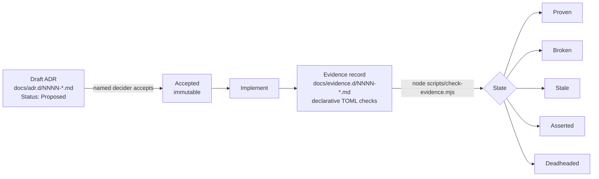
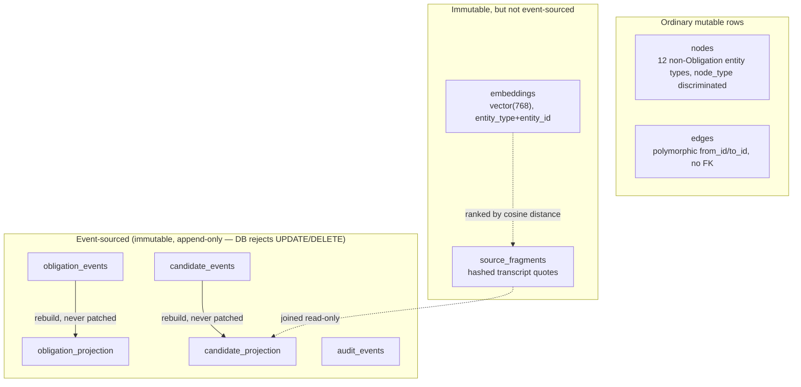

# Ringmaster — Architecture Summary

> Point-in-time snapshot for review, regenerated 2026-08-19. This is a summary
> for orientation, not a governing document — [`docs/adr.d/`](adr.d/README.md)
> is the source of truth for what's actually decided, and `docs/evidence.d/`
> (via `node scripts/check-evidence.mjs`) for what's actually proven.
> Re-generate rather than hand-edit if it drifts.

**Tagline:** *Keep the whole show moving.* A management operating system — an
attention-allocation tool for engineering managers, not a task tracker.
Primary entity is the **Obligation** (promises, requests, risks, decisions,
follow-ups), not work items. North-star question: *what deserves my attention
now, and what will become a problem if I ignore it?*

Repo: [github.com/monk-eee/ringmaster](https://github.com/monk-eee/ringmaster)
(public). Owner/sole decider: **monk-eee**. Status: personal working draft,
single-user v1, actively built by multiple concurrent agent sessions under a
strict ADR-governance process.

---

## 1. Governance model (the repo's defining characteristic)

Every mutation to source, tests, config, infrastructure, or pipelines
requires an **accepted Architecture Decision Record (ADR)** first
([ADR-0001](adr.d/0001-require-governing-adr-coverage-before-implementation.md)).
This is enforced by convention + a CI gate, not by tooling that blocks
commits.

- **ADR** = intent/decision (immutable once accepted; changes go in a *new*
  ADR that amends/supersedes).
- **Evidence** (exact-name companion under `docs/evidence.d/`) = current,
  rerunnable proof, kept deliberately separate
  ([ADR-0002](adr.d/0002-keep-current-evidence-separate-from-accepted-decisions.md))
  so intent and reality can't be confused.
- `node scripts/check-evidence.mjs` derives state from declarative checks
  (`present`/`absent` regex over files, `parity` = every accepted ADR has
  evidence, `manual` = human-asserted, decays to `Stale` after a threshold).
  Never executes shell code from evidence data.
- All 92 ADRs that exist are **Accepted**; `node scripts/check-evidence.mjs`
  currently reports all 92 **Proven** (`ADR-0004`'s manual, policy-only check --
  no sync/export implementation exists to check against -- re-affirmed and
  confirmed clean as of ADR-0086) — zero `Broken`/`Stale`/`Deadheaded`.
  Re-run the checker for the current count.

---

## 2. Product vision

- **Chain:** `Customer Problem → Business Goal → Commitment → Feature → ADO Work → Delivery`.
  The commitment is the durable object; everything else changes around it.
- **Time-centric, not work-centric:**
  `Date/Horizon → Obligation → Risk → Action → Evidence → Outcome`, with a
  7/30/60/90-day future-risk horizon as the eventual goal view (still not
  built — see gaps).
- **"The UX is the product"** — a later, substantial vision addendum
  ([VISION.md § The Daily Brief](VISION.md#the-daily-brief)) reframed the
  home screen itself, not the graph/infrastructure underneath it, as the
  actual product: a ranked, narrative Daily Brief instead of a task
  dashboard, congruence over completion, context-switching as the enemy,
  Timeline over graph/table/kanban as the default view, and a per-person
  Relationship page as external memory. Now substantially real: Today's
  narrative summary line ([ADR-0084](adr.d/0084-today-narrative-summary.md)),
  a Focus Blocks People/All filter — deliberately narrower than the full
  People/Delivery/Leadership/Operations taxonomy, since no such
  classification is stored anywhere in this schema
  ([ADR-0085](adr.d/0085-focus-blocks-people-filter.md)), and a three-pane
  Workbench (Attention/Current focus/Relationship context,
  [ADR-0086](adr.d/0086-workbench-three-pane-view.md)) composing already-proven
  reads with zero new backend routes. Shipped as a new, additive secondary
  tab — not yet promoted to replace Today, matching the precedent Graph
  Explorer itself set ([ADR-0026](adr.d/0026-graph-explorer-frontend.md)→[ADR-0080](adr.d/0080-promote-graph-explorer-to-primary-navigation.md)).
  The full Congruence Engine (drift between a stated commitment and actual
  linked work) remains vision; a narrow, honest v1 slice (an `isolated`
  signal for zero-edge commitments, [ADR-0054](adr.d/0054-congruence-engine-v1-isolated-commitment-signal.md))
  and a `repeated_concern` signal across independent sources
  ([ADR-0082](adr.d/0082-repeated-concern-risk-signal.md)) are real; the
  full four-category taxonomy is explicitly not, for the same reason as
  the Focus Blocks filter above.
- **Six management directions** it tracks obligations across: delivery,
  leadership, team, people, operational, personal.
- **Agent personas** (planned, not built): Chief of Staff, Executive Liaison,
  People Steward, Delivery Steward, Customer Advocate, Risk Sentinel,
  Archivist — reasoning concerns, separate from provider (data-access)
  concerns, MCP as the contract boundary.
- **Design principles:** evidence before confidence (every extraction keeps
  source/quote/confidence), human control before automation (suggest, don't
  auto-act), personal utility before platform.
- Full docs: [VISION.md](VISION.md) (narrative) and
  [PRODUCT-SPEC.md](PRODUCT-SPEC.md) (v0.2, versioned spec — the
  authoritative account where the two disagree).

---

## 3. Tech stack

| Layer | Choice | Governing ADR |
|---|---|---|
| Backend language | Rust (2021 edition), `axum` 0.7, `tokio`, `sqlx` 0.8 | [0005](adr.d/0005-adopt-rust-event-sourced-postgres-commitment-graph.md), [0012](adr.d/0012-minimal-http-api-and-node-web-front-end.md) |
| Storage | Postgres 16 + `pgvector` (mandatory extension) | [0005](adr.d/0005-adopt-rust-event-sourced-postgres-commitment-graph.md), [0007](adr.d/0007-generalize-obligation-and-require-pgvector.md) |
| Frontend | React 18 + Vite 5 SPA (TypeScript, strict) | [0014](adr.d/0014-react-vite-single-page-app.md) (supersedes an earlier server-rendered Express approach, [0012](adr.d/0012-minimal-http-api-and-node-web-front-end.md)) |
| Frontend tests | Playwright (Chromium only) | [0012](adr.d/0012-minimal-http-api-and-node-web-front-end.md) |
| Local dev runtime | Podman Compose (`compose.yaml`, standard Compose format) | [0006](adr.d/0006-local-development-stack-runs-via-podman-compose.md) |
| LLM (extraction) | OpenAI-compatible endpoint, local Ollama, `glm-4.7-flash` | [0011](adr.d/0011-extraction-pipeline-candidate-schema-and-model-adapter.md) |
| Embeddings | OpenAI-compatible endpoint, local Ollama, `nomic-embed-text` (768-dim) | [0018](adr.d/0018-generate-and-store-source-fragment-embeddings.md) |
| CI/CD | GitHub Actions (backend/frontend/governance jobs) | [0017](adr.d/0017-add-github-actions-ci-pipeline.md) |
| Hosting | Public GitHub, `github.com/monk-eee/ringmaster` | [0016](adr.d/0016-publish-repository-publicly-on-github.md) |
| Integration layer | MCP-first; MindLeak ingested as one MCP source, never a shared graph/direct SQLite access | [0003](adr.d/0003-ringmaster-ingests-mindleak-as-an-mcp-source.md) |

---

## 4. Data model

Two deliberately different persistence patterns, chosen per-entity rather
than uniformly:

- **`obligation_events` / `obligation_projection`** — the core aggregate
  ([0005](adr.d/0005-adopt-rust-event-sourced-postgres-commitment-graph.md),
  renamed Commitment→Obligation by
  [0007](adr.d/0007-generalize-obligation-and-require-pgvector.md)). Event
  log is always the source of truth; projection is fully rebuilt, never
  authoritative. Gained nullable `hard_due_at`/`soft_due_at`
  ([0020](adr.d/0020-obligation-due-date-fields.md)) and a nullable
  `source_fragment_id` for evidence traceability, joined read-only against
  `source_fragments` at query time
  ([0023](adr.d/0023-evidence-backed-daily-brief-reasons.md)) — the same
  treatment `candidate_projection` already had.
- **`candidate_events` / `candidate_projection`** — extracted candidates
  (commitment/request/risk/follow_up/decision/expectation), same
  event-sourced pattern, deterministic validation before append
  (`candidate_type` enum, `confidence ∈ [0,1]`)
  ([0011](adr.d/0011-extraction-pipeline-candidate-schema-and-model-adapter.md)).
  Gained a nullable `source_fragment_id` for evidence traceability
  ([0015](adr.d/0015-expose-source-fragment-traceability-on-candidates.md)),
  and a `validation_state` transition (`candidate` → `accepted`/`rejected`,
  one-way, `409` if already transitioned)
  ([0024](adr.d/0024-candidate-accept-reject-buttons.md)) — Epic E5's first
  interactive slice, since completed with promote-to-Obligation
  ([0027](adr.d/0027-promote-accepted-candidate-to-obligation.md)),
  in-place correction before accepting
  ([0045](adr.d/0045-correct-candidate-before-accepting.md)), and bulk
  multi-select triage/promotion
  ([0076](adr.d/0076-bulk-candidate-triage.md)/[0077](adr.d/0077-bulk-candidate-promotion.md)).
- **`audit_events`** — security-relevant action log, same immutability
  guarantee. `record()` calls were wired up for candidate validation
  actions ([0038](adr.d/0038-wire-up-audit-events-for-candidate-validation.md)); now readable end
  to end via `GET /api/audit-events`
  ([0049](adr.d/0049-audit-trail-read-api.md)) and the frontend Activity
  tab ([0008](adr.d/0008-add-append-only-audit-events-table.md) created
  the table with no call sites — that gap is now closed).
- **`nodes` / `edges`** — generic graph substrate for the other 12
  product-spec node types (Person, Meeting, Risk, Decision, …), ordinary
  mutable rows, `node_type`/`edge_type` free-text, no FK enforcement on
  edges (deliberate, app-layer responsibility)
  ([0009](adr.d/0009-add-graph-nodes-edges-and-source-fragments.md)). Gained
  a direct write/traversal API — create/list/patch a node (merge-only
  attribute updates), create an edge, fetch a node with its neighbors
  ([0025](adr.d/0025-node-edge-write-api-and-traversal.md)) — participant/
  speaker names are now resolved to existing Person nodes at ingestion time
  ([0069](adr.d/0069-resolve-participants-to-person-nodes-at-ingestion.md)), but general entity dedup
  (e.g. two independently-created Meeting nodes for the same real event),
  edits/deletes to edges, and multi-hop traversal beyond one hop remain
  explicitly out of scope per that ADR.
- **`source_fragments`** — bounded transcript quotes (speaker, timing,
  SHA-256 hash), append-only/immutable at the DB level so a captured quote
  can never be silently edited
  ([0009](adr.d/0009-add-graph-nodes-edges-and-source-fragments.md),
  [0010](adr.d/0010-transcript-ingestion-parsing-chunking-provenance.md)).
- **`embeddings`** — `vector(768)` fixed-dimension (matches
  `nomic-embed-text`), `entity_type`/`entity_id` keyed, currently only
  `source_fragment` is embedded
  ([0007](adr.d/0007-generalize-obligation-and-require-pgvector.md) created
  it dimension-unconstrained,
  [0018](adr.d/0018-generate-and-store-source-fragment-embeddings.md) fixed
  the dimension).

---

## 5. Backend architecture (`backend/src/`)

| Module | Responsibility |
|---|---|
| `main.rs` | Connects to Postgres, runs `sqlx::migrate!`, rebuilds the Obligation projection once at boot, serves the HTTP API on `:8080`. |
| `api/` | Split by responsibility (ADR-0072): `mod.rs` (`app()` router wiring, shared `ListQuery`/`clamp_list_params`, `/health`), `obligations.rs` (Daily Brief, Time Horizon, Focus Blocks, obligation detail/list routes, `risk_signals`/`daily_brief_reason` shared functions), `ingestion.rs` (meeting/source ingestion + detail routes), `candidates.rs` (candidate list/accept/reject/correct/promote + extraction trigger + `repeated_concern_matches`), `search.rs` (semantic search route), `audit_events.rs` (audit feed route), `nodes.rs` (node/edge CRUD + traversal routes, `person_brief`, `person_career_history`). Every route path and handler is unchanged; only file layout moved. |
| `obligation.rs` | Obligation event vocabulary (`created`/`status_changed`/`closed`), append + projection rebuild, due-date and source-fragment carry-forward, `update_status` (ADR-0093 — the shared edit function the API/CLI/MCP surfaces all call). |
| `extraction.rs` | Candidate event vocabulary, deterministic validation, `extract_candidate_via_model` (calls `model_adapter`), `transition_candidate` (accept/reject). |
| `graph/` | Split by responsibility (ADR-0072): `node.rs` (`nodes` CRUD, `list_nodes`/`update_node`/`upsert_nodes`), `edge.rs` (`edges` CRUD, including temporal-validity supersede), `source_fragment.rs` (`source_fragments` CRUD, `embed_source_fragment`, `search_source_fragments`). `mod.rs` re-exports every item under `crate::graph::*` unchanged. |
| `transcript.rs` | `ingest_transcript`: parses `Speaker: text` turns (explicitly provisional placeholder format), creates a meeting node + hashed fragments. |
| `model_adapter.rs` | Optional OpenAI-compatible chat-completion client (`RINGMASTER_LLM_URL`/`RINGMASTER_MODEL`); typed error, never panics, never blocks when unconfigured. |
| `embedding_adapter.rs` | Same pattern for embeddings (`RINGMASTER_EMBEDDING_URL`/`RINGMASTER_EMBEDDING_MODEL`), independently configurable from the chat model. |
| `audit.rs` | `record()` — append one immutable audit row. Called from candidate accept/reject/promote transitions (ADR-0038); read back via `GET /api/audit-events` (ADR-0049). |

**HTTP API surface** (all under the single `axum::Router` built by `app()` in `api/mod.rs`):

| Route | Method | Behavior |
|---|---|---|
| `/health` | GET | `200 OK` |
| `/api/obligations` | GET | Read-only `obligation_projection` rows, `LEFT JOIN`ed with `source_fragments` for evidence (`source_fragment_id`, `source_text`) |
| `/api/obligations/:id` | GET, PATCH | Read one Obligation with risk signals/linked nodes ([ADR-0047](adr.d/0047-obligation-detail-page.md)) / edit its status and/or due dates, the first edit surface an Obligation has ever had ([ADR-0093](adr.d/0093-obligation-editing-across-surfaces.md)) |
| `/api/daily-brief` | GET | Non-closed obligations ranked by urgency (at-risk first, then soonest due date), each with a deterministic `reason` string that now cites linked evidence or states plainly that none is recorded |
| `/api/time-horizon` | GET | Non-closed obligations bucketed by effective due date into Overdue/Next 7/30/90 days/Beyond, an at-risk Obligation with no date landing in Overdue; reuses the Daily Brief's own `reason` function |
| `/api/focus-blocks` | GET | Non-closed Obligations sharing a linked graph node (person, meeting, …) grouped into a Suggested Focus Block; a node linked to fewer than two counts forms no block |
| `/api/candidates` | GET | Read-only `candidate_projection` rows, `LEFT JOIN`ed with `source_fragments` for evidence (`source_fragment_id`, `source_text`, `speaker`) |
| `/api/candidates/:id/accept` | POST | Transitions a candidate still in the `candidate` state to `accepted`. `200` / `404` (unknown) / `409` (already transitioned) |
| `/api/candidates/:id/reject` | POST | Same, to `rejected` |
| `/api/candidates/:id/promote` | POST | Creates an open Obligation from an `accepted` candidate (carrying its `source_fragment_id` forward), marks the candidate `promoted` with the new Obligation's id linked. `409` for any other `validation_state` |
| `/api/candidates/batch` | POST | Bulk accept/reject multiple candidates in one request, confidence-first ordering ([ADR-0076](adr.d/0076-bulk-candidate-triage.md)) |
| `/api/candidates/batch-promote` | POST | Bulk-promote multiple accepted candidates in one request ([ADR-0077](adr.d/0077-bulk-candidate-promotion.md)) |
| `/api/people/:id/brief` | GET | A person's open commitments (with `risk_signals`) and recent asks (candidates from meetings they participated in, excluding rejected/promoted), each with a source citation ([ADR-0083](adr.d/0083-meeting-brief-generation.md)) |
| `/api/people/:id/career-export` | GET | Every *closed* Obligation linked to a person, with an evidence citation — the honest opposite of `person_brief`'s open-only filter; deliberately unfiltered by category, since none is stored ([ADR-0088](adr.d/0088-career-connect-export.md)) |
| `/api/audit-events` | GET | Chronological activity feed over `audit_events` ([ADR-0049](adr.d/0049-audit-trail-read-api.md)) |
| `/api/source-fragments/:id/extract` | POST | Explicit, synchronous extraction trigger. `201` (created) / `204` (nothing extracted) / `404` (unknown fragment) / `503` (no model configured — typed, never panics) |
| `/api/meetings/ingest` | POST | Atomically creates one Meeting node plus its ordered, hashed source fragments from raw transcript text; `400` on blank required fields; never triggers extraction or embedding implicitly |
| `/api/meetings/:id` | GET | One meeting with its ordered transcript fragments ([ADR-0036](adr.d/0036-meeting-detail-read.md)) |
| `/api/meetings/:id/candidates` | GET | Meeting-scoped candidate listing and extraction progress ([ADR-0037](adr.d/0037-meeting-scoped-candidate-listing.md)) |
| `/api/sources/ingest` | POST | Any dated source type (not just meetings), `occurred_at` required ([ADR-0040](adr.d/0040-dated-source-ingestion.md)) |
| `/api/search` | GET | `?q=&limit=` — embeds the query, ranks `source_fragment` embeddings by pgvector cosine distance (`<=>`). `200` ranked JSON / `400` (missing/blank `q`) / `503` (no embedding model configured) |
| `/api/nodes` | GET, POST | List nodes (optional `?node_type=`, `?needs_attention=`, `?limit=`/`?offset=` per ADR-0059) / create a node |
| `/api/nodes/:id` | GET, PATCH | Fetch a node with its neighboring edges (each edge now carries `valid_from`/`valid_to`; an Obligation-typed neighbor resolves its real status/dates/reason instead of `null`) and, for a `person` node, an `at_risk`/`open` relationship grouping plus `last_interaction_at`/`recent_interactions` ([ADR-0070](adr.d/0070-edge-backed-person-interaction-recency.md)/[ADR-0071](adr.d/0071-person-detail-recent-interactions.md)) / merge-update its attributes |
| `/api/edges` | POST | Create an edge between two existing nodes/obligations. Optional `valid_from` + `supersede: true` closes out any prior current edge sharing the same `(from_id, edge_type)` in one transaction; omitted/false leaves every prior caller unchanged |

**MCP server** (`ringmaster-ingest mcp-serve`, stdio, [ADR-0042](adr.d/0042-occurred-at-retrieval-and-recall-sources-mcp-tool.md)/[ADR-0066](adr.d/0066-non-destructive-graph-management-over-mcp.md)):
12 tools calling the identical Rust functions the HTTP routes use, never
duplicating logic — `ingest_source`, `recall_sources`, `search`,
`list_entities`, `get_entity`, `prepare_meeting_brief`
([ADR-0083](adr.d/0083-meeting-brief-generation.md)), `create_entity`,
`update_entity`, `upsert_entities` (atomic, exact-match, 1-100 entities),
`update_obligation` (status/due dates, [ADR-0093](adr.d/0093-obligation-editing-across-surfaces.md)),
`list_relationships`, `create_relationship`. Deliberately non-destructive:
no delete tool exists for any entity/relationship type.

**CLI** (`ringmaster-ingest`, no running server required, connects directly
to `DATABASE_URL`): the default ingest command, `reindex-embeddings`
([ADR-0063](adr.d/0063-reindex-backfill-embeddings.md)), `mcp-serve`, and
`update-obligation` ([ADR-0093](adr.d/0093-obligation-editing-across-surfaces.md))
— the same `obligation::update_status` function the HTTP route and MCP
tool call.

Common posture across every write/optional-model route: **never automatic**
(extraction and embedding are always explicit calls, never triggered by
ingestion), **never panics**, degrades to a typed `503` rather than blocking
anything when a model isn't configured. Run `cargo test` for the current
pass count (climbing steadily; see `docs/evidence.d/` for what's actually
verified) — including live round-trips against real local models when
`RINGMASTER_LLM_URL`/`RINGMASTER_EMBEDDING_URL` are set, and deterministic
tests that need no live model.

---

## 6. Frontend architecture (`frontend/`)

React 18 + Vite 5 SPA, `npm run dev` on `:3001`. Vite's dev server proxies
`/api/*` to the backend (`BACKEND_URL`, read server-side only — same-origin
from the browser's perspective, no CORS needed).

- **`App.tsx`** — ten tabs. **Primary** ([ADR-0039](adr.d/0039-product-re-steer-primary-navigation.md)/[ADR-0080](adr.d/0080-promote-graph-explorer-to-primary-navigation.md)):
  `Today` (default landing tab, [ADR-0022](adr.d/0022-daily-brief-endpoint.md)),
  `Timeline`, `People`, `Inbox`, `Graph`. **Secondary/"Developer"**:
  `Obligations`, `Search`, `Meetings`, `Activity`, `Workbench`
  ([ADR-0086](adr.d/0086-workbench-three-pane-view.md), shipped secondary-first
  matching Graph Explorer's own precedent).
  - **Today**: a narrative summary line (greeting + honest, zero-omitted
    `date_compression`/`stale` counts, [ADR-0084](adr.d/0084-today-narrative-summary.md))
    above the existing ranked list, a capped **"What am I forgetting?"**
    section composing every risk signal ([ADR-0053](adr.d/0053-what-am-i-forgetting.md)),
    and a **Suggested Focus Blocks** card grouping non-closed Obligations
    sharing a linked node *and* Time Horizon bucket
    ([ADR-0031](adr.d/0031-suggested-focus-blocks.md)/[ADR-0052](adr.d/0052-context-derived-focus-sessions.md)),
    with a People/All filter toggle \u2014 the one attention-type distinction
    groundable in real data today ([ADR-0085](adr.d/0085-focus-blocks-people-filter.md)).
  - **Timeline**: the same Obligation data as a zoomable, bucketed lens
    ([ADR-0029](adr.d/0029-time-horizon-view.md)/[ADR-0035](adr.d/0035-time-horizon-timeline-view.md)),
    now also surfacing a linked source's own `occurred_at`
    ([ADR-0079](adr.d/0079-timeline-surfaces-source-occurred-at.md)).
  - **People**: defaults to who-needs-attention, an explicit toggle shows
    everyone ([ADR-0051](adr.d/0051-relationship-workspace.md)); cards and
    the detail header show a deterministic colored-initials avatar and
    pill-shaped at-risk/open badges, not plain text
    ([ADR-0091](adr.d/0091-people-view-avatar-and-badge-redesign.md));
    person detail shows `last_interaction_at`, a capped Recent Interactions
    list with source citations ([ADR-0071](adr.d/0071-person-detail-recent-interactions.md)),
    an `at_risk`/`open` Relationship grouping, and a **Career export**
    section \u2014 every closed Obligation linked to the person as
    copy-to-clipboard plain text, the artifact for a Connect
    self-assessment ([ADR-0088](adr.d/0088-career-connect-export.md)).
  - **Inbox** (candidates, relabeled from "Candidates"): Accept/Reject/Correct/Promote,
    single and bulk (multi-select, confidence-first ordering,
    [ADR-0076](adr.d/0076-bulk-candidate-triage.md)/[ADR-0077](adr.d/0077-bulk-candidate-promotion.md)).
  - **Graph**: create/list/filter nodes, drill into attributes/lifecycle
    state, add relationships (optionally superseding a prior current one,
    [ADR-0032](adr.d/0032-temporal-edge-validity-supersede-on-write.md)),
    and a progressive, reversible **traversal trail**
    ([ADR-0033](adr.d/0033-progressive-graph-traversal-trail.md)) with an
    **Actions lens** filtering the neighbourhood down to Obligation/risk
    neighbours ([ADR-0081](adr.d/0081-graph-explorer-actions-lens.md)).
  - **Workbench**: three panes \u2014 Attention (`DailyBrief`, unchanged),
    Current focus (`ObligationDetail`, now editable — see below), Relationship
    context (a new `PersonBriefPanel` calling `GET /api/people/:id/brief`) —
    selecting a left-pane item fills the other two without page navigation,
    zero new backend routes ([ADR-0086](adr.d/0086-workbench-three-pane-view.md)).
  - **Meetings**: Meeting Review \u2014 transcript fragments with inline
    extracted candidates ([ADR-0043](adr.d/0043-meeting-review-page.md)).
  - **Activity**: a flat, chronological feed over `audit_events`
    ([ADR-0049](adr.d/0049-audit-trail-read-api.md)).
- **`components/`** — `DailyBrief.tsx`, `ForgettingSection.tsx`,
  `FocusBlocks.tsx`, `ObligationDetail.tsx` (now has an Edit form for
  status/due dates, [ADR-0093](adr.d/0093-obligation-editing-across-surfaces.md)),
  `ObligationsTable.tsx`,
  `CandidatesTable.tsx`, `SearchResults.tsx`, `StatusBadge.tsx`,
  `GraphExplorer.tsx`, `TimeHorizon.tsx`, `TimeHorizonTimeline.tsx`,
  `People.tsx`, `PersonBriefPanel.tsx`, `Workbench.tsx`, `MeetingReview.tsx`,
  `Activity.tsx`, `ComingSoonStrip.tsx` — presentational. Obligation/
  candidate/node type labels and icons are human-readable across every
  surface via a shared `typeIcon()` vocabulary
  ([ADR-0030](adr.d/0030-human-readable-titles-and-type-iconography.md)).
  A visual design refresh ([ADR-0074](adr.d/0074-visual-design-system-refresh.md))
  restyled every surface with zero behavior change; a further People-view
  pass added colored avatars/pill badges ([ADR-0091](adr.d/0091-people-view-avatar-and-badge-redesign.md)),
  and a shared-row-typography declutter fixed a real CSS selector-leak bug
  plus added a safe `renderBoldSegments()` helper (`markdown.ts`, never
  `dangerouslySetInnerHTML`) so real `**bold**` markdown in evidence quotes
  renders instead of showing literal asterisks
  ([ADR-0095](adr.d/0095-daily-brief-row-decluttering.md)).
- **`api.ts`** — typed `fetch` wrappers, including `searchSourceFragments`,
  `fetchPersonBrief`, `fetchCareerHistory`, `updateObligation` (PATCH,
  [ADR-0093](adr.d/0093-obligation-editing-across-surfaces.md)).
- Playwright spec (`tests/obligations.spec.ts`) exercises real client-side
  interaction (tab switching, search, multi-step graph traversal,
  bulk-select, Workbench pane-filling), not just static DOM structure.
  `playwright.config.ts` starts its own dedicated backend/Vite pair on
  ports 18080/13001 against `ringmaster_test`
  ([ADR-0073](adr.d/0073-isolate-playwright-from-dev-database.md)) and
  raises `expect.timeout` to 10s to tolerate legitimate multi-worker
  concurrency against that one shared pair
  ([ADR-0087](adr.d/0087-graph-explorer-reliability-under-concurrent-load.md)).

The Search tab (`GET /api/search`, query box, ranked results with speaker +
similarity) and the Daily Brief tab were both added as presentational
surfaces over an already-accepted, already-additive read route — a
precedent set by
[ADR-0015](adr.d/0015-expose-source-fragment-traceability-on-candidates.md)'s
evidence column, then explicitly ratified for the Search tab by
[ADR-0021](adr.d/0021-ratify-search-tab-surfaced-without-its-own-adr.md).

---

## 7. Infrastructure & CI/CD

**Local dev**
([0006](adr.d/0006-local-development-stack-runs-via-podman-compose.md)):
`podman compose up -d` brings up `postgres` (pgvector image), `backend`,
`frontend` — local-dev-only, explicitly not a deployment artifact. A
startup log line on both `backend`/`frontend` states the exact commit SHA
and timestamp they were built from, so a stale container is visible
immediately instead of requiring a manual `docker inspect` comparison
([ADR-0078](adr.d/0078-log-build-provenance-to-detect-stale-containers.md)).

**CI** ([0017](adr.d/0017-add-github-actions-ci-pipeline.md)) —
`.github/workflows/ci.yml`, on every push/PR to `main`:

| Job | Steps |
|---|---|
| `backend` | Postgres+pgvector service container → apply `backend/migrations/*.sql` via `psql` → `cargo test` → `cargo audit` via `rustsec/audit-check` ([ADR-0090](adr.d/0090-ci-enforced-dependency-vulnerability-scanning.md)) |
| `frontend` | `npm ci` → `npm audit --omit=dev --audit-level=high` ([ADR-0090](adr.d/0090-ci-enforced-dependency-vulnerability-scanning.md)) → `tsc --noEmit` → `vite build` |
| `governance` | `node scripts/check-evidence.mjs` → `git diff --check` (the exact gate [AGENTS.md](../AGENTS.md) mandates locally, now automatic) |

Explicitly deferred: end-to-end Playwright in CI (runs locally against a
dedicated backend/Vite pair instead, ADR-0073), deployment/CD (no target
chosen yet), branch protection rules.

---

## 8. Security & data-boundary posture

- **Single-user v1**
  ([ADR-0004](adr.d/0004-defer-multi-user-access-control-single-user-v1.md)):
  one operator, one local Postgres, no authorization model.
  People-commitment content (performance/promotion data) must never sync
  externally, export to logs/telemetry, or become visible to a second
  account without a new governing ADR.
- **Public repo, private data**: source code/ADRs/schema are public
  ([ADR-0016](adr.d/0016-publish-repository-publicly-on-github.md)); this
  is explicitly scoped as *not* reopening the ADR-0004 runtime-data
  boundary. A pre-publish audit (full tracked history, `.env.example`,
  compose defaults, MCP config) found no secrets; one real gap
  (`.gitignore` not actually excluding `.env`) was found and closed before
  publishing.
- **Append-only/immutable by DB trigger**, not just convention, for
  `obligation_events`, `candidate_events`, `audit_events`,
  `source_fragments` — mutation/deletion is rejected at the database level.
- **MindLeak boundary**
  ([ADR-0003](adr.d/0003-ringmaster-ingests-mindleak-as-an-mcp-source.md)):
  ingested only via MindLeak's own MCP tools, translated into Ringmaster's
  own graph at the boundary — no shared schema, no live query federation,
  no direct SQLite access.
- **Dependency vulnerability scanning** ([ADR-0089](adr.d/0089-patch-vite-nanoid-security-advisories.md)/[ADR-0090](adr.d/0090-ci-enforced-dependency-vulnerability-scanning.md)/[ADR-0092](adr.d/0092-fix-ci-cargo-audit-permissions-and-document-rsa-advisory.md)):
  two high-severity Vite/nanoid advisories were found and patched via a
  minimal-version bump (not the major-version jump `npm audit fix --force`
  would have applied); CI now runs `npm audit`/`cargo audit` on every
  push/PR so a future dependency bump can't silently reintroduce a known
  vulnerability. `frontend/Dockerfile`'s `CMD ["npx", "vite"]` means the
  actual running frontend container is Vite's dev server, not a static
  build — these are live vulnerabilities in the running app, not deferred
  dev-tooling concerns. ADR-0092 fixed a real gap the other two didn't
  catch locally: `rustsec/audit-check` needs `checks: write`, which the
  default `GITHUB_TOKEN` permissions don't grant, so the job failed in
  live CI even though `cargo audit` itself ran clean — confirmed fixed in
  a real CI run (`32223737027`).

---

## 9. Full ADR index

| # | Decision | Status |
|---|---|---|
| 0001 | Require governing ADR coverage before implementation | Accepted |
| 0002 | Keep current evidence separate from accepted decisions | Accepted |
| 0003 | MindLeak ingested as an MCP source, not a shared graph | Accepted |
| 0004 | Single-user v1; sensitive commitment data stays local | Accepted |
| 0005 | Rust + event-sourced Postgres commitment graph | Accepted |
| 0006 | Local dev stack via Podman Compose | Accepted |
| 0007 | Rename aggregate Commitment→Obligation; require pgvector | Accepted |
| 0008 | Append-only `audit_events` skeleton (no call sites yet) | Accepted |
| 0009 | Generic `nodes`/`edges`/`source_fragments` graph substrate | Accepted |
| 0010 | Transcript ingestion: parsing, chunking, immutable fragments | Accepted |
| 0011 | Extraction pipeline: candidate schema, validation, model adapter | Accepted |
| 0012 | Minimal HTTP API + server-rendered front end + Playwright | Accepted |
| 0013 | HTTP routes to trigger/list extraction candidates | Accepted |
| 0014 | Replace server-rendered front end with React/Vite SPA | Accepted |
| 0015 | Expose source-fragment traceability on candidates | Accepted |
| 0016 | Publish repository publicly on GitHub | Accepted |
| 0017 | GitHub Actions CI pipeline | Accepted |
| 0018 | Generate and store embeddings for source fragments | Accepted |
| 0019 | Semantic search over embedded source fragments | Accepted |
| 0020 | Add due-date fields to Obligation (Epic E7 schema prerequisite) | Accepted |
| 0021 | Ratify Search tab surfaced without its own ADR (retroactive) | Accepted |
| 0022 | Read-only Daily Brief endpoint: Obligations ranked by urgency | Accepted |
| 0023 | Evidence-backed Daily Brief reasons: source-fragment traceability on Obligation | Accepted |
| 0024 | Accept/reject buttons for candidates (Epic E5's first interactive slice) | Accepted |
| 0025 | Node/edge write API and neighborhood traversal | Accepted |
| 0026 | Graph explorer frontend: data entry, drill-down, relationship visualization | Accepted |
| 0027 | Promote an accepted candidate into an Obligation | Accepted |
| 0028 | Person relationship view: resolve linked Obligations into a per-person page | Accepted |
| 0029 | Time Horizon view: Obligations bucketed by due-date window | Accepted |
| 0030 | Human-readable titles and type iconography across the UI | Accepted |
| 0031 | Suggested Focus Blocks: group Obligations sharing a linked node | Accepted |
| 0032 | Temporal edge validity: supersede-on-write and relationship history | Accepted |
| 0033 | Progressive graph traversal trail over one-hop neighborhoods | Accepted |
| 0034 | Expose atomic meeting-transcript ingestion over HTTP | Accepted |
| 0035 | Time Horizon timeline view: zoomable Buckets/Timeline toggle over the existing bucketed data | Accepted |
| 0036 | Meeting detail read: one meeting with its ordered transcript fragments | Accepted |
| 0037 | Meeting-scoped candidate listing and extraction progress | Accepted |
| 0038 | Wire up `audit_events` for candidate validation actions | Accepted |
| 0039 | Product re-steer: Today/Timeline/People/Inbox as primary navigation | Accepted |
| 0040 | Dated source ingestion: `occurred_at` required across every source | Accepted |
| 0041 | Risk Engine v1: staleness and date-compression signals | Accepted |
| 0042 | Surface `occurred_at` on nodes, date-range retrieval, second MCP tool | Accepted |
| 0043 | Meeting Review page: transcript fragments with inline candidates | Accepted |
| 0044 | Today attention items show management meaning, not identifiers | Accepted |
| 0045 | Correct a candidate before accepting it | Accepted |
| 0046 | Unowned-obligation risk signal via existing `owns` edges | Accepted |
| 0047 | Obligation detail page: a first-class read view over existing data | Accepted |
| 0049 | Audit trail read API: a chronological activity feed | Accepted |
| 0050 | Today attention budget: cap Focus Blocks, honest "show all" | Accepted |
| 0051 | Relationship workspace: People shows who needs something from you | Accepted |
| 0052 | Context-derived Focus Sessions: group by node *and* timeframe | Accepted |
| 0053 | "What am I forgetting?": compose risk signals into one capped list | Accepted |
| 0054 | Congruence Engine v1: flag a commitment with no linked node at all | Accepted |
| 0056 | Local test-database isolation, plus a reviewable dev-data cleanup | Accepted |
| 0057 | Enforce test-database isolation with a runtime guard | Accepted |
| 0058 | Extract a due date from a candidate, carry it to the promoted obligation | Accepted |
| 0059 | List-view pagination for Obligations, Candidates, and People | Accepted |
| 0060 | Extract an owner name from a candidate, link it at promotion | Accepted |
| 0061 | A derived Obligation health label composing existing status/signals | Accepted |
| 0062 | Auto-embed fragments on ingest (best-effort), so search has data | Accepted |
| 0063 | Reindex/backfill embeddings for fragments ingested before auto-embed | Accepted |
| 0064 | Semantic search MCP tool | Accepted |
| 0065 | Model adapter: optional API key, hosted-first | Accepted |
| 0066 | Expose non-destructive graph management over MCP | Accepted |
| 0067 | Pin the local frontend to port 3001 | Accepted |
| 0068 | Add an optional API key to the embedding adapter | Accepted |
| 0069 | Resolve participant/speaker names to existing Person nodes at ingestion | Accepted |
| 0070 | Derive Person interaction recency from identity edges, legacy fallback | Accepted |
| 0071 | Surface recent interaction sources on Person detail | Accepted |
| 0072 | Split oversized, low-cohesion backend modules, no behavior change | Accepted |
| 0073 | Isolate Playwright from the development database | Accepted |
| 0074 | Visual design system refresh, zero behavior change | Accepted |
| 0075 | Restore the mascot logo in the app header | Accepted |
| 0076 | Bulk candidate triage: multi-select accept/reject, confidence-first | Accepted |
| 0077 | Bulk candidate promotion: complete the triage loop ADR-0076 started | Accepted |
| 0078 | Log build provenance so stale containers are visible on startup | Accepted |
| 0079 | Timeline surfaces a linked source's own `occurred_at` | Accepted |
| 0080 | Promote Graph Explorer to primary navigation | Accepted |
| 0081 | Add an Actions lens to Graph Explorer's neighbourhood view | Accepted |
| 0082 | Repeated-concern signal: the same risk across multiple meetings | Accepted |
| 0083 | Meeting-brief generation: open commitments, recent asks, one call | Accepted |
| 0084 | Today's narrative summary: the ranked count line VISION.md describes | Accepted |
| 0085 | Focus Sessions filter to People-linked blocks | Accepted |
| 0086 | Workbench: a three-pane, no-navigation view over already-built data | Accepted |
| 0087 | Graph Explorer create-node reliability under concurrent Playwright load | Accepted |
| 0088 | Career/Connect export: a person's completed obligation history | Accepted |
| 0089 | Patch high-severity Vite/nanoid security advisories | Accepted |
| 0090 | CI enforces `npm audit` and `cargo audit` | Accepted |
| 0091 | People view redesign: avatars, status badges, elevated card layout | Accepted |
| 0092 | Fix CI cargo-audit job: grant checks:write, document the one unfixable advisory | Accepted |
| 0093 | Obligation editing: status and due dates, across API/CLI/MCP/UI | Accepted |
| 0095 | Declutter shared row typography: bold rendering, risk-signal pills, quote treatment | Accepted |

See [`docs/adr.d/README.md`](adr.d/README.md) for the live index — this
table is a snapshot and will drift. 92 ADRs are committed, numbered
through `ADR-0095` (`0048` and `0055` were never used — a numbering gap,
not a missing/broken decision; `0094` exists on disk as a concurrent
session's in-progress, uncommitted candidate-synthesis-pass ADR, not yet
part of the committed count). All 92 committed ADRs are Accepted and
Proven as of this snapshot (`node scripts/check-evidence.mjs`).

## 10. Known gaps / deferred work (named explicitly by their own ADRs)

- **Genuine domain-category classification for Obligations.** No `kind`
  column exists distinguishing People/Delivery/Leadership/Operations —
  confirmed repeatedly ([ADR-0082](adr.d/0082-repeated-concern-risk-signal.md)/[ADR-0085](adr.d/0085-focus-blocks-people-filter.md)/[ADR-0088](adr.d/0088-career-connect-export.md)).
  This blocks the full VISION.md attention-type taxonomy for Focus
  Sessions, a dedicated BCDR/compliance view
  (`docs/IMPROVEMENT-PLAN.md` §4), and the full Congruence Engine's
  four-category grouping. A real classification, set at extraction/
  promotion time, would need its own bounded ADR and is deliberately not
  attempted speculatively.
- **ADO/work-item source coverage** (`docs/IMPROVEMENT-PLAN.md` §3):
  named as the actual first decision needed to unblock the full Congruence
  Engine (checking a commitment against real delivery work) and any
  Outlook/Teams/Calendar/SharePoint connector. Explicitly gated on a
  data-access-control policy decision, not a bounded implementation
  choice — not drafted speculatively.
- **Epic E5 (Validation UI)** — [ADR-0024](adr.d/0024-candidate-accept-reject-buttons.md)
  shipped Accept/Reject, [ADR-0027](adr.d/0027-promote-accepted-candidate-to-obligation.md)
  promotion, [ADR-0045](adr.d/0045-correct-candidate-before-accepting.md)
  correction, and [ADR-0076](adr.d/0076-bulk-candidate-triage.md)/[ADR-0077](adr.d/0077-bulk-candidate-promotion.md)
  bulk triage/promotion. Fully closed as originally scoped.
- **Epic E7 (attention/risk-horizon engine)** and **Epic E8 (rich web
  home)** — the Daily Brief ([ADR-0022](adr.d/0022-daily-brief-endpoint.md)/
  [ADR-0023](adr.d/0023-evidence-backed-daily-brief-reasons.md)), Time
  Horizon ([ADR-0029](adr.d/0029-time-horizon-view.md)), and Suggested Focus
  Blocks ([ADR-0031](adr.d/0031-suggested-focus-blocks.md)) are real, shipped
  first slices of this (urgency ranking, due-date bucketing, shared-node
  grouping, all with cited evidence). A real Risk Engine now exists as a
  composed set of individually-shipped signals — staleness/date-compression
  ([ADR-0041](adr.d/0041-risk-engine-v1-staleness-and-date-compression-signals.md)),
  unowned obligations
  ([ADR-0046](adr.d/0046-unowned-obligation-risk-signal.md)), and
  repeated-concern across meetings
  ([ADR-0082](adr.d/0082-repeated-concern-risk-signal.md)), composed into
  one capped "What am I forgetting?" list
  ([ADR-0053](adr.d/0053-what-am-i-forgetting.md)) — not the originally
  envisioned nine-signal design, but a real, evidence-backed subset. The
  Congruence Engine likewise shipped a v1: flagging a commitment with no
  linked node at all
  ([ADR-0054](adr.d/0054-congruence-engine-v1-isolated-commitment-signal.md)). The
  *full* Congruence Engine (drift between a stated commitment and actual
  linked delivery work) remains deferred, explicitly blocked on the ADO/
  work-item source coverage decision named above.
- **Graph substrate** ([ADR-0025](adr.d/0025-node-edge-write-api-and-traversal.md)/
  [ADR-0026](adr.d/0026-graph-explorer-frontend.md)) has a working write
  API and frontend, now with temporal validity
  ([ADR-0032](adr.d/0032-temporal-edge-validity-supersede-on-write.md)) and a
  progressive traversal trail
  ([ADR-0033](adr.d/0033-progressive-graph-traversal-trail.md)), but still
  no entity resolution/dedup (creating a node for the same real-world
  person/meeting twice is possible), no multi-hop traversal beyond one
  direct neighbor at a time (the trail composes repeated one-hop calls
  client-side; the API boundary itself is unchanged), and no node-type-specific
  attribute validation.
- **Hybrid search** — only plain vector similarity exists; keyword/full-text
  fusion, metadata filters, and graph expansion from a search hit are all
  deferred ([0019](adr.d/0019-semantic-search-over-source-fragments.md)).
- **`audit_events`** was created with no call sites
  ([0008](adr.d/0008-add-append-only-audit-events-table.md)); that gap is
  now closed — wired up for candidate validation actions
  ([0038](adr.d/0038-wire-up-audit-events-for-candidate-validation.md)) and
  readable via `GET /api/audit-events`
  ([0049](adr.d/0049-audit-trail-read-api.md)). Still not audited: node/edge
  writes, obligation promotion, and ingestion itself.
- **Transcript parser** is an explicitly provisional `Speaker: text`
  placeholder, not a real Teams/Scout export format — now reachable over
  HTTP ([ADR-0034](adr.d/0034-http-meeting-transcript-ingestion.md)) but the
  parsing format itself is unchanged.
- **No dedup/idempotency** anywhere yet — repeated ingestion or extraction
  calls create duplicate rows by design (deferred, not a bug).
- **Time Horizon timeline** ([ADR-0035](adr.d/0035-time-horizon-timeline-view.md))
  shipped the discrete version of the reference component monk-eee shared:
  five fixed bands, two-state zoom, pan-by-band-focus. A true continuous/
  arbitrary-zoom date axis and congruence-based banding (needs the full
  Congruence Engine, still deferred per above) remain explicitly deferred
  by that same ADR; severity color could now draw on the shipped Risk
  Engine signals but has not been wired up.
- **Meeting Review** ([ADR-0043](adr.d/0043-meeting-review-page.md)) shipped:
  transcript fragments with inline extracted candidates, validated beside
  the source. [MEETING-REVIEW-DESIGN.md](MEETING-REVIEW-DESIGN.md) records
  the original product-design intent this ADR implements.
- **MindLeak/Ringmaster boundary** for federation depth, and the full
  multi-user authorization model, remain explicitly open per
  [VISION.md](VISION.md#open-questions-for-future-adrs).
